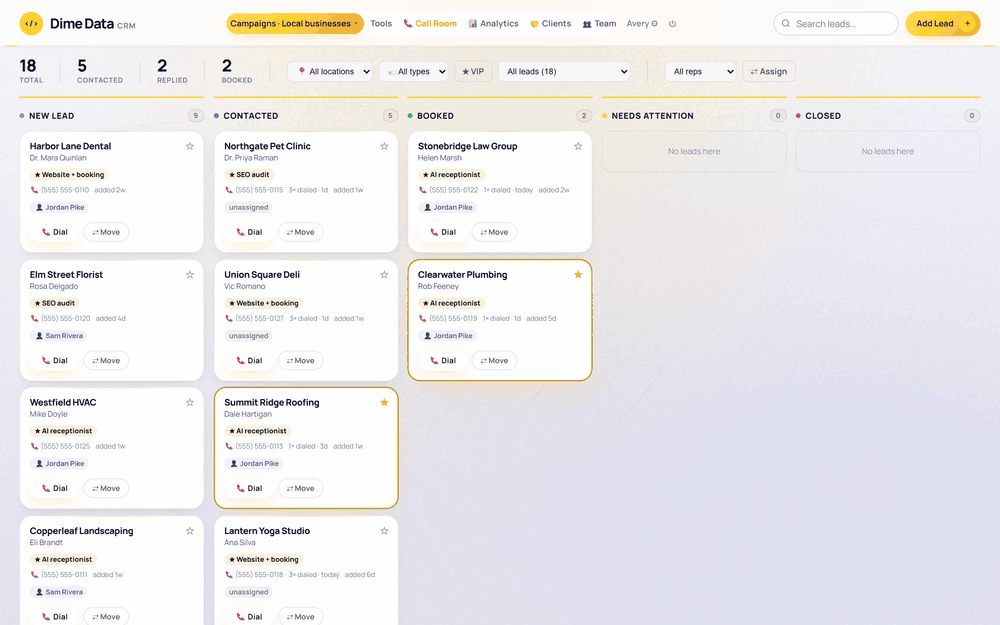
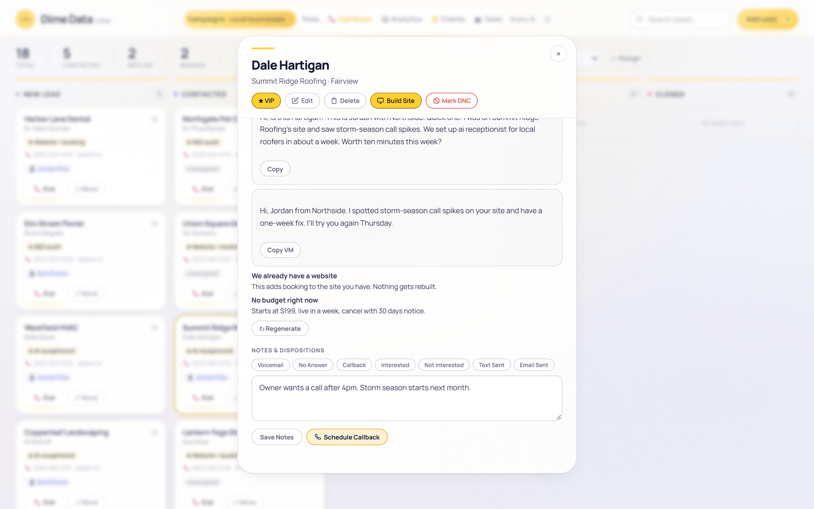
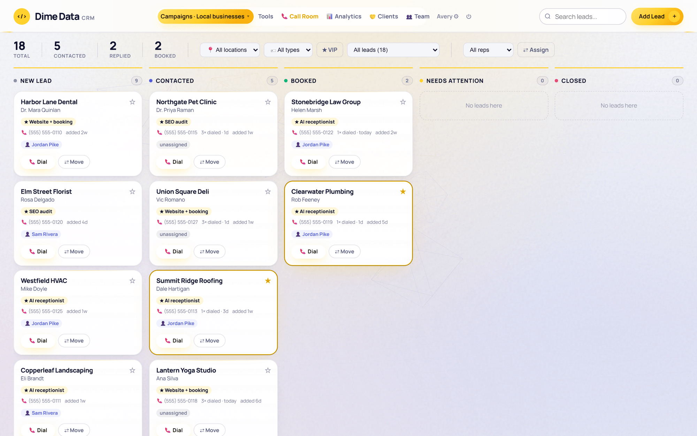
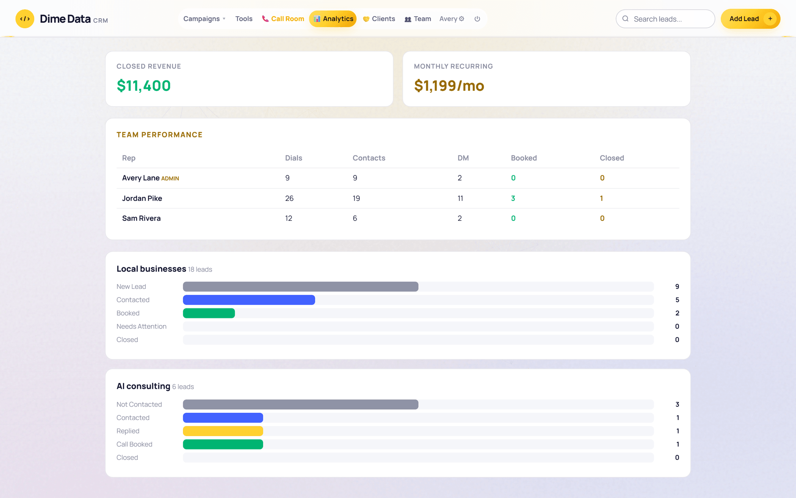
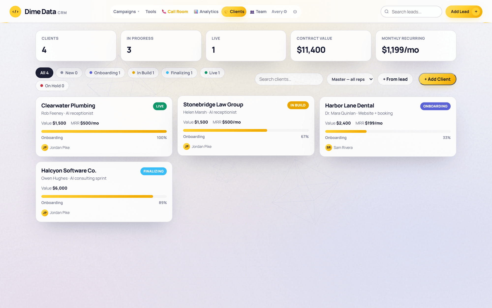
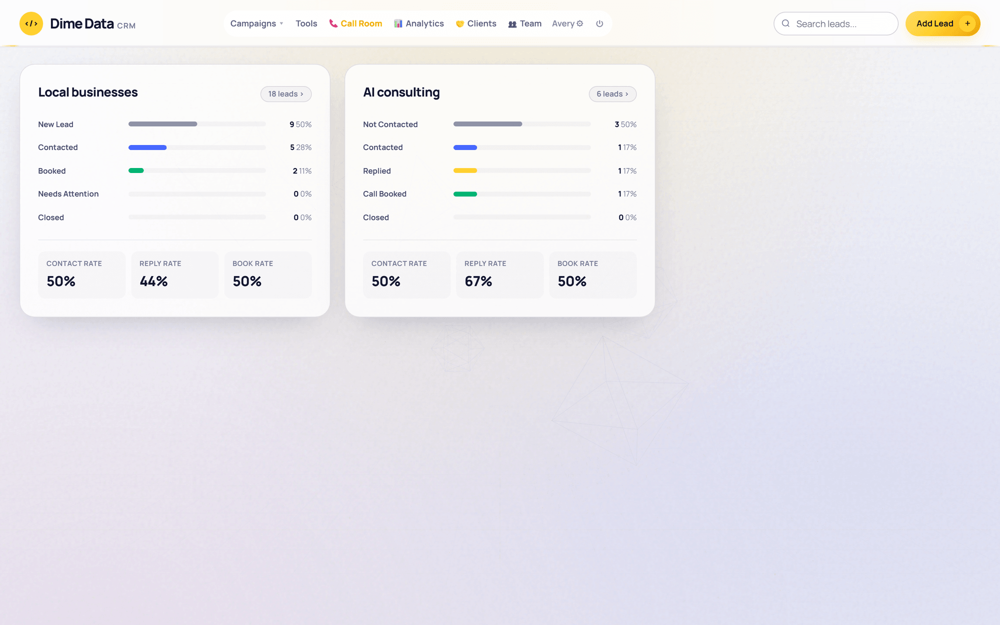
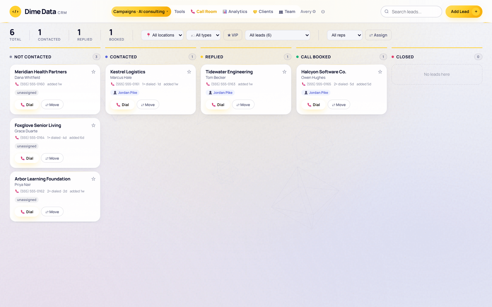
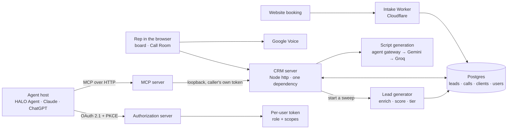

# Dime Data CRM

**A CRM built around the call, not the record.** It's what Dime Data's own outbound
runs on: a board per campaign, a lead panel that says why this business and why now, and a Call
Room that puts the next lead, its script and its objection handles on one screen with a key for
every outcome. Agents get the same CRM over MCP, signed in as a person, never as a back door.

**In production** for Dime Data's own outbound since June 2026 · source is private.

Every screen here is the real server running locally against an in-memory stand-in for its
database, seeded with fictional businesses in a fictional town ("Fairview, OH"), `.example`
domains and 555-01xx numbers. No customer data.

## The problem

Off-the-shelf CRMs are built to store records, and a rep on the phones doesn't need records. They
need the next number to dial, one line on why this business needs us this week, a script that
names the problem we actually saw, and a way to log the outcome without breaking stride. Everything
else (assignment, follow-ups, who's booking, what's closed) should fall out of the calls.

## What it does

| | |
|---|---|
| **Why now, on every lead** | Each lead arrives enriched: a recommended service with the evidence for it, a why-now line, fit (can they pay) and intent (why now) scores, a T1/T2 tier with a call-within window, buying signals, and owner-first contacts. |
| **The Call Room** | A focused dialer. One lead at a time, filtered to new, follow-up or callbacks due, mine or everyone's. Dial opens Google Voice and logs the dial; one key logs the outcome (N, V, C, I, X, T) and the arrow keys move on. |
| **Scripts written for this lead** | A cold-call script, a voicemail and objection handles that cite the problem found on the business's own site. Generated through the agent gateway first, then Gemini, with Groq as the last fallback. |
| **Boards per campaign** | Drag-and-drop pipelines with their own stages (local businesses and enterprise consulting run different funnels), VIP flags, rep assignment, location and type filters. |
| **Reps and admins** | Per-user accounts, campaign access per rep, rep-scoped reads on every route. Analytics counts dials, contacts, decision-maker conversations and bookings per rep. |
| **Clients after the close** | A lead becomes a client with an onboarding checklist (intake, MSA, SOW, deposit, build, sign-off, live), contract value and recurring revenue. |
| **Agents as first-class users** | The CRM is an OAuth 2.1 authorization server and an MCP server. An agent host connects with a sign-in and a consent screen, and every tool call runs as that person, under their role and scopes. There's no delete tool. |
| **Embeddable** | It can be framed inside HALO Agent. Framing is off unless named hosts are allowed, and the session cookie only relaxes for those hosts, with a same-origin check on every write. |

## How it works

**One server, almost no dependencies.** The whole CRM is Node's `http` module and `bcryptjs`:
no framework, no ORM, no front-end build. The dashboard is server-rendered HTML with inline
scripts, so a deploy is one file in a container, and a check in the image build parses every inline
script before it ships.

**Agents can't do anything a person couldn't.** The MCP server never touches the database. Each
tool is a call back into the CRM's own HTTP API on loopback, carrying the caller's own token, so
rep scoping, field allow-lists and the CSRF rule apply to an agent exactly as they do to the person
it's acting for. Tokens come from a real sign-in: PKCE is required, redirect URIs match byte for
byte, codes are single-use and short-lived, refresh tokens rotate, and a read-only grant hides the
write tools altogether.

**Sessions survive deploys and still end when they should.** Sessions are signed, stateless
tokens, so swapping the container doesn't log the team out. That makes "sign out my other devices"
hard, because there's no row to delete. A per-user credentials epoch solves it: any session issued
before your password last changed is refused.

## Built with

JavaScript on Node · Node's `http` module, no framework · bcryptjs · Postgres via a PostgREST API
· Docker behind Caddy · Cloudflare Workers · Gemini and Groq · OAuth 2.1 and the Model Context
Protocol · Playwright for the browser checks.

## By the numbers

| | |
|---|---|
| Tests | **30** passing in the API-token, OAuth, MCP and engine-gate suites (measured 2026-10-07) |
| Agent surface | **18** MCP tools, **11** of them read-only, and no delete |
| Server | **5,406** lines in one file, **1** runtime dependency |
| Commits | **63** to the CRM, 2026-06-11 to 2026-09-12 |

## Read the code

[`excerpts/`](excerpts) has three files from the private source: the MCP server, the OAuth 2.1
authorization server, and the session code with its credentials epoch.

## Status

Live, for Dime Data's own use; it isn't sold as a product. The source is private; this
repository is a showcase. © 2026 Dime Data, all rights reserved (see [LICENSE](LICENSE)). Built
by [Dime Data](https://dimedata.cloud).
